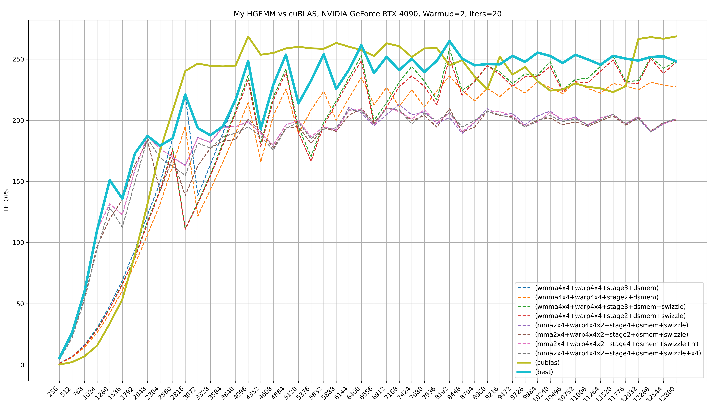
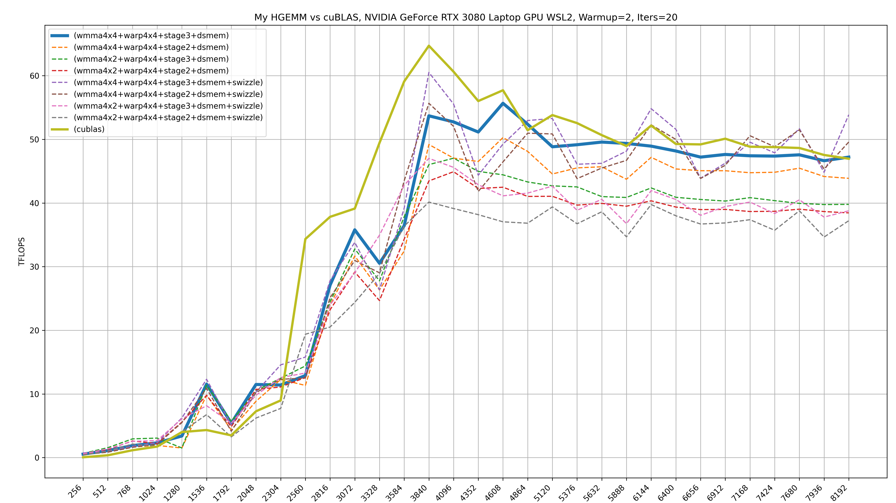

# HGEMM 

## HGEMM/SGEMM Supported Matrix

|CUDA Cores|Sliced K(Loop over K)|Tile Block|Tile Thread|
|:---:|:---:|:---:|:---:|
|✔️|✔️|✔️|✔️|
|**WMMA(m16n16k16)**|**MMA(m16n8k16)**|**Pack LDST(128 bits)**|**SMEM Padding**|
|✔️|✔️|✔️|✔️|
|**Copy Async**|**Tile MMA(More Threads)**|**Tile Warp(More Values)**|**Multi Stages**|  
|✔️|✔️|✔️|✔️|
|**Reg Double Buffers**|**Block Swizzle**|**Warp Swizzle**|**Collective Store(Reg Reuse&Warp Shfl)**|
|✔️|✔️|✔️|✔️|
|**Row Major(NN)**|**Col Major(TN)**|**SGEMM TF32**|**SMEM Swizzle(CuTe)**|
|✔️|✔️|✔️|✔️|

<details>
<summary> 🔑️ 点击查看所有支持的HGEMM Kernels! </summary>  
  
- [X] hgemm_sliced_k_f16_kernel 
- [X] hgemm_t_8x8_sliced_k_f16x4_kernel(unpack)
- [X] hgemm_t_8x8_sliced_k_f16x4_pack_kernel(pack 16x4)
- [X] hgemm_t_8x8_sliced_k_f16x4_bcf_kernel(bank conflicts reduce)
- [X] hgemm_t_8x8_sliced_k_f16x4_pack_bcf_kernel(bank conflicts reduce, pack)
- [X] hgemm_t_8x8_sliced_k_f16x8_pack_bcf_kernel(bank conflicts reduce, pack)
- [X] hgemm_t_8x8_sliced_k_f16x8_pack_bcf_dbuf_kernel(bank conflicts reduce, pack, double buffers)
- [X] hgemm_t_8x8_sliced_k16/32_f16x8_pack_bcf_dbuf_kernel(pack, double buffers)
- [X] hgemm_t_8x8_sliced_k16/32_f16x8_pack_bcf_dbuf_async_kernel(pack, double buffers, copy async)
- [X] hgemm_wmma_m16n16k16_naive(WMMA) 
- [X] hgemm_wmma_m16n16k16_mma4x2(WMMA, Tile MMA) 
- [X] hgemm_wmma_m16n16k16_mma4x2_warp2x4(TWMMA, Tile MMA/Warp, pack) 
- [X] hgemm_wmma_m16n16k16_mma4x2_warp2x4_async(WMMA, Tile MMA/Warp, Copy Async) 
- [X] hgemm_wmma_m16n16k16_mma4x2_warp2x4_async_offset(WMMA, Tile MMA/Warp, Copy Async, Pad)
- [X] hgemm_wmma_m16n16k16_mma4x2_warp2x4_dbuf_async(WMMA, Tile MMA/Warp, Copy Async, Double Buffers, Pad)  
- [X] hgemm_wmma_m16n16k16_mma4x2_warp2x4_stages(WMMA, Tile MMA/Warp, Copy Async, Stages, Pad, Block swizzle) 
- [X] hgemm_wmma_m16n16k16_mma4x2_warp4x4_stages(WMMA, Tile MMA/Warp, Copy Async, Stages, Pad, Block swizzle)
- [X] hgemm_wmma_m16n16k16_mma4x4_warp4x4_stages(WMMA, Tile MMA/Warp, Copy Async, Stages, Pad, Block swizzle) 
- [X] hgemm_wmma_m32n8k16_mma2x4_warp2x4_dbuf_async(WMMA, Tile MMA/Warp, Copy Async, Double Buffers, Pad)
- [X] hgemm_mma_m16n8k16_naive(MMA)
- [X] hgemm_mma_m16n8k16_mma2x4_warp4x4(MMA, Tile MMA/Warp, pack)
- [X] hgemm_mma_m16n8k16_mma2x4_warp4x4_stages(MMA, Tile MMA/Warp, Copy Async, Stages, Pad, Block swizzle)
- [X] hgemm_mma_m16n8k16_mma2x4_warp4x4x2_stages(MMA, Tile MMA/Warp, Copy Async, Stages, Pad, Block swizzle, Warp swizzle, Reg Double Buffers, Collective Store with Reg Reuse & Warp Shuffle) 
- [X] hgemm_mma_stages_tn_cute(MMA, Tile MMA/Warp, Copy Async, Stages, SMEM Swizzle) 
- [X] PyTorch bindings

</details>

## 测试命令

**CUTLASS**: 更新CUTLASS依赖库
```bash
git submodule update --init --recursive --force
```

**Python**: 支持python脚本直接测试

```bash
# 只测试Ada架构 不指定默认编译所有架构 耗时较长: Volta, Ampere, Ada, Hopper, ...
export TORCH_CUDA_ARCH_LIST=Ada 
python3 hgemm.py --wmma # test defalut wmma kernels for all MNK
python3 hgemm.py --mma  # test defalut mma kernels for all MNK
python3 hgemm.py --M 16384 --N 16384 --K 8192 --i 10 --wmma # test default wmma kernels for specific MNK
python3 hgemm.py --M 16384 --N 16384 --K 8192 --i 10 --mma # test default mma kernels for specific MNK
python3 hgemm.py --wmma-all # test all wmma kernels for all MNK
python3 hgemm.py --mma-all # test all mma kernels for all MNK
python3 hgemm.py --cuda-all --wmma-all --mma-all # test all kernels for all MNK
python3 hgemm.py --cute-tn --no-default # test cute hgemm kernels with smem swizzle for all MNK
```
如果需要绘制TFLOPS曲线图，需要先安装matplotlib，并指定--plot-flops（或--plot）选项:
```bash
python3 -m pip install matplotlib
# topk指定只绘制性能最好的topk个kernel
python3 hgemm.py --mma-all --plot --topk 8
# test default mma kernels & cute hgemm kernels with smem swizzle for all MNK
python3 hgemm.py --cute-tn --mma --plot 
```

**C++**: C++测试目前仅支持CuTe HGEMM，C++ bin方式测试的性能数据会略优于python测试方式，可能是torch binding引入了一定的开销。
```bash
make
./hgemm_cute.bin
# NVIDIA L20
algo = CUTE HGEMM Stages 2
M N K =    256    256    256, Time =   0.00001946   0.00002007   0.00002048 s, AVG Performance =     1.6718 Tflops
M N K =    512    512    512, Time =   0.00003174   0.00003277   0.00003379 s, AVG Performance =     8.1920 Tflops
M N K =    768    768    768, Time =   0.00004506   0.00004608   0.00004710 s, AVG Performance =    19.6608 Tflops
M N K =   1024   1024   1024, Time =   0.00005837   0.00005929   0.00006042 s, AVG Performance =    36.2202 Tflops
M N K =   9216   9216   9216, Time =   0.01371546   0.01371679   0.01371853 s, AVG Performance =   114.1314 Tflops
M N K =   9472   9472   9472, Time =   0.01458586   0.01458924   0.01460531 s, AVG Performance =   116.4991 Tflops
M N K =   9728   9728   9728, Time =   0.01597747   0.01597931   0.01598157 s, AVG Performance =   115.2239 Tflops
M N K =   9984   9984   9984, Time =   0.01741721   0.01742008   0.01743462 s, AVG Performance =   114.2598 Tflops
M N K =  10240  10240  10240, Time =   0.01839923   0.01840046   0.01840230 s, AVG Performance =   116.7081 Tflops
M N K =  10496  10496  10496, Time =   0.01993421   0.01993523   0.01993728 s, AVG Performance =   116.0059 Tflops
M N K =  10752  10752  10752, Time =   0.02151629   0.02151956   0.02153472 s, AVG Performance =   115.5219 Tflops
M N K =  11008  11008  11008, Time =   0.02315571   0.02315663   0.02315878 s, AVG Performance =   115.2073 Tflops
M N K =  11264  11264  11264, Time =   0.02484634   0.02484808   0.02484941 s, AVG Performance =   115.0311 Tflops
M N K =  11520  11520  11520, Time =   0.02659226   0.02659430   0.02659840 s, AVG Performance =   114.9738 Tflops
M N K =  11776  11776  11776, Time =   0.02780057   0.02780426   0.02781082 s, AVG Performance =   117.4660 Tflops
M N K =  12032  12032  12032, Time =   0.03024179   0.03024701   0.03025818 s, AVG Performance =   115.1757 Tflops
M N K =  12288  12288  12288, Time =   0.03214848   0.03215698   0.03217306 s, AVG Performance =   115.3980 Tflops
M N K =  12544  12544  12544, Time =   0.03410842   0.03411661   0.03412173 s, AVG Performance =   115.7104 Tflops
M N K =  12800  12800  12800, Time =   0.03612979   0.03613184   0.03613491 s, AVG Performance =   116.0833 Tflops
M N K =  13056  13056  13056, Time =   0.03820134   0.03820769   0.03821671 s, AVG Performance =   116.4956 Tflops
M N K =  15872  15872  15872, Time =   0.06917632   0.06927145   0.06936883 s, AVG Performance =   115.4438 Tflops
M N K =  16128  16128  16128, Time =   0.07299379   0.07302472   0.07304806 s, AVG Performance =   114.8951 Tflops
```

## 目前性能  

### NVIDIA L20  

目前最优的实现，在L20上（理论Tensor Cores FP16算力为 119.5 TFLOPS），整体上能达到cuBLAS大概99%左右的性能。使用WMMA API能达到cuBLAS大概95%~98%左右的性能(105-113 TFLOPS vs 105-115 TFLOPS)，使用MMA API能达到115 TFLOPS，部分case会超越cuBLAS。CuTe版本的HGEMM性能基本持平cuBLAS，部分case会超越cuBLAS，能达到116-117 TFLOPS。目前通过padding和smem swizzle的方式缓解bank conflicts。对于NN layout，使用smem padding缓解bank conflicts；对于TN layout，通过cutlass cute的smem swizzle/permuted消除bank conflicts。

<div id="NV-L20"></div>


<!---

--->


- WMMA: Up to 113.76 TFLOPS, 113.83/119.5=95.25% TFLOPS utilization, 113.83/116.25=97.91% cuBLAS performance.
- MMA: Up to 115.12 TFLOPS, 115.12/119.5=96.33% TFLOPS utilization, 115.12/116.25=99.03% cuBLAS performance.

```bash
python3 hgemm.py --M 16384 --N 16384 --K 8192 --mma-all --wmma-all --cuda-all
----------------------------------------------------------------------------------------------------------------------------------
                                        M=16384, N=16384, K=8192, Warmup=2, Iters=10, 1/1
----------------------------------------------------------------------------------------------------------------------------------
                                   (naive): ['-236.75   ', '176.0     '], time:1835.537ms, swizzle: NOOP, TFLOPS: 2.40  (+0.00%)
                      (f16x8pack+t8x8+bcf): ['-236.75   ', '176.0     '], time:99.63080ms, swizzle: NOOP, TFLOPS: 44.14 (+1742.34%)
                 (f16x8pack+t8x8+k16+dbuf): ['-236.75   ', '176.0     '], time:98.20067ms, swizzle: NOOP, TFLOPS: 44.79 (+1.46%)
--------------------------------------------------------------------WMMA----------------------------------------------------------
                         (wmma4x2+warp2x4): ['-234.0    ', '181.0     '], time:55.99505ms, swizzle: NOOP, TFLOPS: 78.54 (+75.37%)
                  (wmma4x2+warp2x4+stage3): ['-234.0    ', '181.0     '], time:49.62856ms, swizzle: NOOP, TFLOPS: 88.62 (+12.83%)
            (wmma4x2+warp2x4+stage3+dsmem): ['-234.0    ', '181.0     '], time:49.62389ms, swizzle: NOOP, TFLOPS: 88.63 (+0.01%)
          (wmma4x2+warp2x4+stage3+swizzle): ['-234.0    ', '181.0     '], time:39.11254ms, swizzle: 4096, TFLOPS: 112.45(+26.87%)
          (wmma4x2+warp2x4+stage2+swizzle): ['-234.0    ', '181.0     '], time:38.63754ms, swizzle: 4096, TFLOPS: 113.83(+1.23%)
--------------------------------------------------------------------MMA-----------------------------------------------------------
           (mma2x4+warp4x4+stage2+swizzle): ['-234.0    ', '181.0     '], time:38.40544ms, swizzle: 4096, TFLOPS: 114.52(+0.60%)
     (mma2x4+warp4x4+stage2+dsmem+swizzle): ['-234.0    ', '181.0     '], time:38.20540ms, swizzle: 4096, TFLOPS: 115.12(+0.52%)
                                  (cublas): ['-234.0    ', '181.0     '], time:37.83144ms, swizzle: NOOP, TFLOPS: 116.25(+0.99%)
----------------------------------------------------------------------------------------------------------------------------------
```
全量MNK测试命令（提示: 每个MNK单独测试的性能数据更准确）
```bash
python3 hgemm.py --mma-all --wmma-all --cuda-all
```

### NVIDIA GeForce RTX 4090
在NVIDIA RTX 4090上(FP16 Tensor Cores算力为330 TFLOPS)，WMMA(m16n16k16)性能表现比MMA(m16n8k16)要更好，大分部MNK下，本仓库的实现能达到cuBLAS 95%~99%的性能，某些case能超过cuBLAS。就本仓库的实现而言，在RTX 4090上，大规模矩阵乘(MNK>=8192)，WMMA表现更优，小规模矩阵乘，MMA表现更优。

<!---

--->



```bash
----------------------------------------------------------------------------------------------------------------------------------
                                        M=16384, N=16384, K=8192, Warmup=2, Iters=10, 1/1
----------------------------------------------------------------------------------------------------------------------------------
--------------------------------------------------------------------WMMA----------------------------------------------------------
                                 (wmma4x2): ['-137.375  ', '53.65625  '], time:90.05668ms, swizzle: NOOP, TFLOPS: 48.84 (+0.00%)
                         (wmma4x2+warp2x4): ['-137.375  ', '53.65625  '], time:37.53635ms, swizzle: NOOP, TFLOPS: 117.17(+139.92%)
                  (wmma4x2+warp2x4+stage3): ['-137.375  ', '53.65625  '], time:25.96564ms, swizzle: NOOP, TFLOPS: 169.38(+44.56%)
                  (wmma4x2+warp2x4+stage2): ['-137.375  ', '53.65625  '], time:25.21226ms, swizzle: NOOP, TFLOPS: 174.44(+2.99%)
          (wmma4x2+warp2x4+stage3+swizzle): ['-137.375  ', '53.65625  '], time:22.99013ms, swizzle: 4096, TFLOPS: 191.30(+9.67%)
          (wmma4x2+warp2x4+stage2+swizzle): ['-137.375  ', '53.65625  '], time:22.91676ms, swizzle: 4096, TFLOPS: 191.91(+0.32%)
    (wmma4x2+warp2x4+stage2+dsmem+swizzle): ['-137.375  ', '53.65625  '], time:22.78118ms, swizzle: 4096, TFLOPS: 193.06(+0.60%)
            (wmma4x4+warp4x4+stage3+dsmem): ['-137.375  ', '53.65625  '], time:18.66145ms, swizzle: NOOP, TFLOPS: 235.68(+22.08%)
    (wmma4x4+warp4x4+stage3+dsmem+swizzle): ['-137.375  ', '53.65625  '], time:18.16847ms, swizzle: 4096, TFLOPS: 242.07(+2.71%)
    (wmma4x4+warp4x4+stage2+dsmem+swizzle): ['-137.375  ', '53.65625  '], time:18.11864ms, swizzle: 4096, TFLOPS: 242.74(+0.28%)
                                  (cublas): ['-137.375  ', '53.65625  '], time:18.07777ms, swizzle: NOOP, TFLOPS: 243.28(+0.23%)
----------------------------------------------------------------------------------------------------------------------------------
----------------------------------------------------------------------------------------------------------------------------------
                                        M=8192, N=8192, K=8192, Warmup=2, Iters=10, 1/1
----------------------------------------------------------------------------------------------------------------------------------
--------------------------------------------------------------------WMMA----------------------------------------------------------
                                 (wmma4x2): ['11.453125 ', '-1.0664062'], time:18.48518ms, swizzle: NOOP, TFLOPS: 59.48 (+0.00%)
                         (wmma4x2+warp2x4): ['11.453125 ', '-1.0664062'], time:9.354352ms, swizzle: NOOP, TFLOPS: 117.54(+97.61%)
                  (wmma4x2+warp2x4+stage3): ['11.453125 ', '-1.0664062'], time:5.835342ms, swizzle: NOOP, TFLOPS: 188.42(+60.31%)
                  (wmma4x2+warp2x4+stage2): ['11.453125 ', '-1.0664062'], time:5.795311ms, swizzle: NOOP, TFLOPS: 189.72(+0.69%)
            (wmma4x2+warp2x4+stage3+dsmem): ['11.453125 ', '-1.0664062'], time:5.795168ms, swizzle: NOOP, TFLOPS: 189.73(+0.00%)
          (wmma4x2+warp2x4+stage3+swizzle): ['11.453125 ', '-1.0664062'], time:5.384325ms, swizzle: 2048, TFLOPS: 204.21(+7.63%)
            (wmma4x4+warp4x4+stage3+dsmem): ['11.453125 ', '-1.0664062'], time:4.254937ms, swizzle: NOOP, TFLOPS: 258.41(+26.54%)
                                  (cublas): ['11.421875 ', '-1.3203125'], time:4.288864ms, swizzle: NOOP, TFLOPS: 256.36
----------------------------------------------------------------------------------------------------------------------------------
----------------------------------------------------------------------------------------------------------------------------------
                                        M=4096, N=4096, K=4096, Warmup=2, Iters=10, 1/1
----------------------------------------------------------------------------------------------------------------------------------
--------------------------------------------------------------------WMMA----------------------------------------------------------
                                 (wmma4x2): ['-9.0      ', '-144.875  '], time:2.341437ms, swizzle: NOOP, TFLOPS: 58.70 (+0.00%)
                         (wmma4x2+warp2x4): ['-9.0      ', '-144.875  '], time:1.237440ms, swizzle: NOOP, TFLOPS: 111.07(+89.22%)
                  (wmma4x2+warp2x4+stage3): ['-9.0      ', '-144.875  '], time:0.725293ms, swizzle: NOOP, TFLOPS: 189.49(+70.61%)
            (wmma4x2+warp2x4+stage3+dsmem): ['-9.0      ', '-144.875  '], time:0.723266ms, swizzle: NOOP, TFLOPS: 190.03(+0.28%)
          (wmma4x2+warp2x4+stage3+swizzle): ['-9.0      ', '-144.875  '], time:0.702548ms, swizzle: 2048, TFLOPS: 195.63(+2.95%)
    (wmma4x2+warp2x4+stage3+dsmem+swizzle): ['-9.0      ', '-144.875  '], time:0.702190ms, swizzle: 2048, TFLOPS: 195.73(+0.05%)
            (wmma4x4+warp4x4+stage3+dsmem): ['-9.0      ', '-144.875  '], time:0.556564ms, swizzle: NOOP, TFLOPS: 246.94(+26.17%)
                                  (cublas): ['-9.0      ', '-144.875  '], time:0.539851ms, swizzle: NOOP, TFLOPS: 254.59(+3.10%)
----------------------------------------------------------------------------------------------------------------------------------
```

### NVIDIA GeForce RTX 3080 Laptop   

在NVIDIA GeForce RTX 3080 Laptop上测试，使用mma4x4_warp4x4（16 WMMA m16n16k16 ops, warp tile 64x64）以及Thread block swizzle，大部分case能持平甚至超过cuBLAS，使用Windows WSL2 + RTX 3080 Laptop进行测试。



```bash
python3 hgemm.py --wmma-all
----------------------------------------------------------------------------------------------------------------------------------
                              M=16384, N=16384, K=8192, Warmup=5, Iters=20, 27/27
----------------------------------------------------------------------------------------------------------------------------------
           (wmma4x4+warp4x4+stage3+dsmem): ['68.375    ', '-2.234375 '], time:96.91984ms, swizzle: NOOP, TFLOPS: 45.38 (+0.00%)
           (wmma4x4+warp4x4+stage2+dsmem): ['68.375    ', '-2.234375 '], time:102.8722ms, swizzle: NOOP, TFLOPS: 42.75
   (wmma4x4+warp4x4+stage3+dsmem+swizzle): ['68.375    ', '-2.234375 '], time:85.65800ms, swizzle: 4096, TFLOPS: 51.34 (+13.15%)
   (wmma4x4+warp4x4+stage2+dsmem+swizzle): ['68.375    ', '-2.234375 '], time:95.70884ms, swizzle: 4096, TFLOPS: 45.95
                                 (cublas): ['68.375    ', '-2.234375 '], time:104.2092ms, swizzle: NOOP, TFLOPS: 42.20
----------------------------------------------------------------------------------------------------------------------------------
```


## 性能优化笔记

### PyTorch HGEMM Profile

在Ada架构下，PyTorch 2.4对FP16使用matmul时，会调用:
```C++
ampere_fp16_s1688gemm_fp16_128x128_ldg8_f2f_stages_32x1_nn_kernel
```
内部实际使用HMMA(Tensor Cores)进行计算，在3080上profile发现使用:
```C++
sm80_xmma_gemm_f16f16_f16f32_f32_nn_n_tilesize96x64x32_stage3_warpsize2x2x1_tensor16x8x16_kernel
```
因此，只有实现使用Tensor Cores的HGEMM，才有可能接近PyTorch/cuBLAS的性能。
```bash
ncu -o hgemm.prof -f python3 prof.py
nsys profile --stats=true -t cuda,osrt,nvtx -o hgemm.prof --force-overwrite true python3 prof.py
```
- SASS (L20)

```C
// ampere_fp16_s1688gemm_fp16_128x128_ldg8_f2f_stages_32x1_nn_kernel
310	00007f41 37d5b850	      LDSM.16.M88.4 R192, [R169+UR8+0x2000] 
311	00007f41 37d5b860	      LDSM.16.M88.4 R196, [R169+UR8+0x2800]
336	00007f41 37d5b9f0	      HMMA.1688.F32 R112, R182, R196, R112
...
```

### SMEM Padding  

#### Bank Conflicts的产生
  
含义：在访问shared memory时，因多个线程读写同一个Bank中的不同数据地址时，导致shared memory 并发读写 退化 成顺序读写的现象叫做Bank Conflict；


SM调度单位为一个warp（一个warp内32个Thread），shared_memory 可以 被一个warp中的所有（32个）线程进行访问，shared_memory 映射到大小相等的32个Bank上，Bank的数据读取带宽为32bit / cycle (4 bytes)，因此，主要需要考虑一个Warp内32线程的访问共享内存时的bank冲突。
对于多个线程读取同一个Bank数据时（不同地址），硬件把内存读写请求，拆分成 conflict-free requests，进行顺序读写，此时将会触发多次内存事务。特别地，当一个warp中的所有线程读写同一个地址时，会触发broadcast机制，此时不会退化成顺序读写。上面提到触发broadcast机制的条件是all threads acess same address，但在翻阅cuda-c-programming-guide以及最新版本的[NVProfGuide](https://docs.nvidia.com/nsight-compute/ProfilingGuide/index.html) 时，发现只要是多个thread 读写就会触发broadcast（不需要All）。
  
- 多个线程读同一个数据时，仅有一个线程读，然后broadcast到其他线程
- 多个线程写同一个数据时，仅会有一个线程写成功

NVIDIA的[文章](https://developer.nvidia.com/blog/using-shared-memory-cuda-cc/)中指出，我们还可以通过 `cudaDeviceSetSharedMemConfig()` 函数设置默认Bank Size（默认为4 bytes）来避免bank conflicts，可设置为cudaSharedMemBankSizeFourByte或者cudaSharedMemBankSizeEightByte。对于某些场景来说，设置cudaSharedMemBankSizeEightByte或许更加合适，比如使用double数据类型时。 

```C
cudaDeviceSetSharedMemConfig(cudaSharedMemBankSizeEightByte);
```
目前通过padding和smem swizzle的方式缓解bank conflicts。对于NN layout，使用smem padding缓解bank conflicts；对于TN layout，通过cutlass cute的smem swizzle/permuted消除bank conflicts。

### 双缓冲 Double Buffers

本仓库实现的HGEMM Double Buffers策略如下：1）主循环从bk = 1 开始，第一次数据加载在主循环之前，最后一次计算在主循环之后，这是pipeline 的特点决定的；2）由于计算和下一次访存使用的Shared Memory不同，因此主循环中每次循环只需要一次__syncthreads()即可，对比非double buffers版本，总共节省了 ((K + BK - 1) / BK) - 1 次block内的同步操作。比如，bk=1时，HFMA计算使用的是s_a[0]和s_b[0]，因此，和s_a[1]和s_b[1]的加载是没有依赖关系的。HFMA计算，从global内存到s_a[1]和s_b[1]和HFMA计算可以并行。s_a[1]和s_b[1]用于加载下一块BK需要的数据到共享内存；3）由于GPU不能向CPU那样支持乱序执行，主循环中需要先将下一次循环计算需要的Gloabal Memory中的数据load 到寄存器，然后进行本次计算，之后再将load到寄存器中的数据写到Shared Memory，这样在LDG指令向Global Memory做load时，不会影响后续HFMA及其它运算指令的 launch 执行，也就达到了Double Buffers的目的，具体代码见[hgemm.cu](./hgemm.cu)。

<details>
<summary> 🔑️ 更多性能优化笔记(TODO) ！Click here! </summary>    

### Tile Block

TODO

### Tile Thread

TODO

### Pack LDST 128 bits

TODO

### Async Copy

TODO

### Multi Stages

TODO

### Tensor Cores(WMMA/MMA)

TODO

### Tile MMA/Warp

TODO 

### Thread Block Swizze 

TODO

### Warp Swizzle

TODO

### Reg Double Buffers

TODO

### Collective Store(Reg Reuse&Warp Shuffle)

TODO

### SMEM Swizzle/Permuted

TODO

</details>

## 参考文献 

- [CUDA编程概念】一、什么是bank conflict？](https://zhuanlan.zhihu.com/p/659142274)
- [解决 bank conflict](https://github.com/PaddleJitLab/CUDATutorial/blob/develop/docs/09_optimize_reduce/02_bank_conflict/README.md)
- [Bank Conflict free 的几种方式](https://zhuanlan.zhihu.com/p/722286440)
- [Using Shared Memory in CUDA C/C++](https://developer.nvidia.com/blog/using-shared-memory-cuda-cc/)
- [CUDA（三）：通用矩阵乘法：从入门到熟练](https://zhuanlan.zhihu.com/p/657632577)

